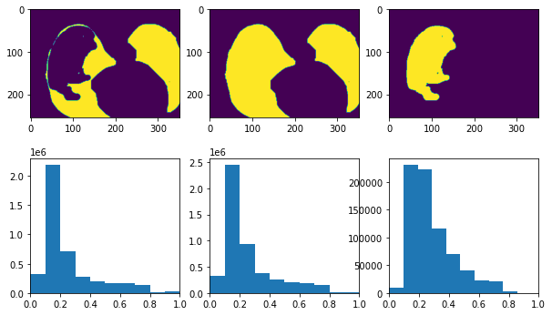
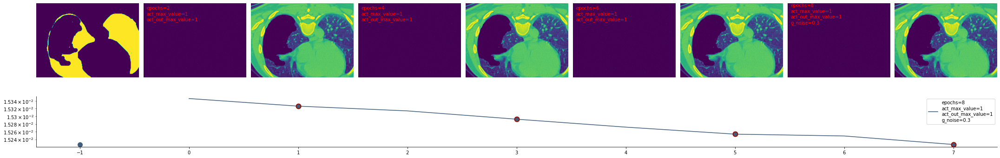

# Inpaint lung CT covid lesions
> Use inpainting to replace covid19 lesions with pseudo healthy textures.


Replace covid19 lesions in a CT using a unet.

## Install

`pip install octaviomtz/inpaint_covid`

## How to use

### 0. Imports

```python
import numpy as np
import matplotlib.pyplot as plt
from scipy.ndimage import label
import tensorflow as tf
from tqdm.notebook import tqdm
from tqdm.keras import TqdmCallback
from tensorflow.keras import backend as K
```

### 1. Load and preprocess a CT scan and its masks:

```python
path_source = '/mnt/c/Users/octav/Documents/Datasets/COVID-19-20_v2/'
filename = 'covid19-A-0003_ct.nii.gz'
ct, ct_mask, ct_seg = read_covid_CT_and_mask(path_source, filename)
ct, ct_mask, ct_seg = normalize_rotate(ct, ct_mask, ct_seg)
```

```python
print(np.shape(ct_mask))
plt.imshow(ct[...,100])
plt.imshow(ct_mask[...,100], alpha=.3)
```

    (512, 512, 291)


    <matplotlib.image.AxesImage at 0x7f4b24951f10>


### 2. Use the lung segmentation to use a smaller version of the CT

```python
# largest connected component
labelled, nr = label(ct_seg>0)
largest_component = (labelled == (np.bincount(labelled.flat)[1:].argmax() + 1))
ct_small, ct_mask_small, ct_seg_small = pad_volume_to_multiple_32(largest_component, ct, ct_mask, ct_seg)
```

```python
labelled, nr = label(ct_seg_small>0)
largest_component = (labelled == (np.bincount(labelled.flat)[1:].argmax() + 1))
a=np.swapaxes(np.swapaxes(largest_component,1,2),0,1)
b=np.swapaxes(np.swapaxes(ct_mask_small,1,2),0,1)
plot_3d_2(a, b, .5, detail_speed=8, detail_speed2=8, figsize=(4,5))
```


### 3. Get the masks

```python
bkgd = ct_seg_small == 0
target_mask = np.logical_or(bkgd,ct_mask_small)
target_mask = ~target_mask
target_mask2 = ~bkgd
target_mask3 = ct_mask_small.astype(bool)
```

```python
SLICE=100
fig, ax = plt.subplots(2,3,figsize=(10,6))
ax[0,0].imshow(target_mask[...,SLICE])
ax[1,0].hist(ct_small[np.where(target_mask!=0)].flatten()); ax[1,0].set_xlim([0,1])
ax[0,1].imshow(target_mask2[...,SLICE])
ax[1,1].hist(ct_small[np.where(target_mask2!=0)].flatten()); ax[1,1].set_xlim([0,1])
ax[0,2].imshow(target_mask3[...,SLICE])
ax[1,2].hist(ct_small[np.where(target_mask3!=0)].flatten()); ax[1,2].set_xlim([0,1])
```


    (0.0, 1.0)





### 4. Inpainting

```python
mask_target = np.expand_dims(target_mask,0) 
mask_target2 = np.expand_dims(target_mask2,0)
mask_target3 = np.expand_dims(target_mask3,0)
```

```python
# parameters
g_noise= 0.3
act_max_value = 1
act_out_max_value = 1
NOISE_REDUCTION = 0.75
EPOCHS = 2
EPOCHS_sneak_peek = 2
lr_value = 0.0001
LR_REDUCE = 1
```

```python
input_noise = np.random.rand(np.shape(ct_small)[0] ,np.shape(ct_small)[1], np.shape(ct_small)[2])
input_noise = np.expand_dims(input_noise,0) * NOISE_REDUCTION
target = np.expand_dims(ct_small,0)
```

```python
# USE THIS TO WORK WITH ONLY ONE SLICE
# SLICE = 100
# mask_target = np.expand_dims(mask_target[...,SLICE],-1)
# mask_target2 = np.expand_dims(mask_target2[...,SLICE],-1)
# mask_target3 = np.expand_dims(mask_target3[...,SLICE],-1)
# input_noise = np.expand_dims(input_noise[...,SLICE],-1)
# target = np.expand_dims(target[...,SLICE],-1)
# IMG_HEIGHT, IMG_WIDTH, IMG_CHANNELS  = np.shape(target[0])
# print(np.shape(mask_target),np.shape(mask_target2),np.shape(mask_target3),np.shape(input_noise), np.shape(target))
```

```python
results_all = []
predicted_all = []
epochs_saved = [0]
previous_epochs = 0
model = unet5(ct_small)
opt = tf.keras.optimizers.Adam(lr_value)
loss_masked, mask_used = choose_loss(mask_target, mask_target2, mask_target3, LOSS_USED=0)
model.compile(optimizer=opt, loss=loss_masked)
```

```python
# Train model
for i in tqdm(range(2)):
    results = model.fit(input_noise, target,  epochs=EPOCHS, verbose=0, callbacks=[TqdmCallback(verbose=0)]);
    results_all.extend(results.history['loss'])
    predicted_all.append(model.predict(input_noise)[0,...])
    epochs_saved.append(epochs_saved[-1] + EPOCHS)
    # sneak peek
    loss_masked, mask_used = choose_loss(mask_target, mask_target2, mask_target3, LOSS_USED=2)
    results = model.fit(input_noise, target,  epochs=EPOCHS_sneak_peek, verbose=0, callbacks=[TqdmCallback(verbose=0)]);
    loss_masked, mask_used = choose_loss(mask_target, mask_target2, mask_target3, LOSS_USED=0)
    results_all.extend(results.history['loss'])
    predicted_all.append(model.predict(input_noise)[0,...])
    epochs_sneak_peak = epochs_saved[-1] + EPOCHS_sneak_peek
    epochs_saved.append(epochs_sneak_peak)

    lr_value = lr_value * LR_REDUCE
    K.set_value(model.optimizer.learning_rate, lr_value)
```

    
    
    
    
    


```python
# If using only one slice SLICE = 0
SLICE = 100
plot_4_inpaints(np.asarray(predicted_all)[...,SLICE], epochs_saved, target[0,...,SLICE], mask_used, mask_target3[0,...,SLICE], act_max_value, act_out_max_value, results_all, g_noise, blend='blend', slice_mask=SLICE)
```




